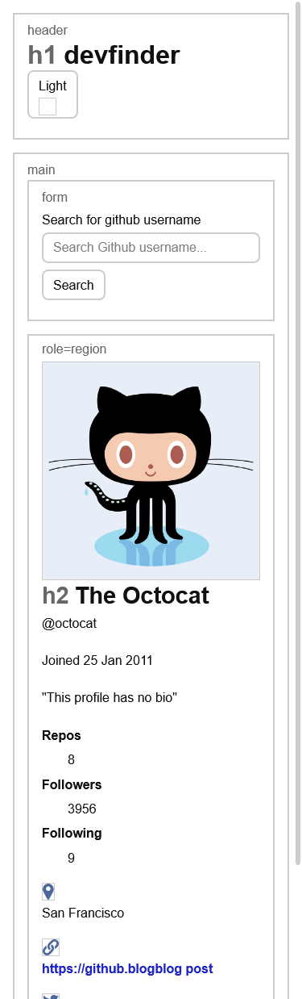
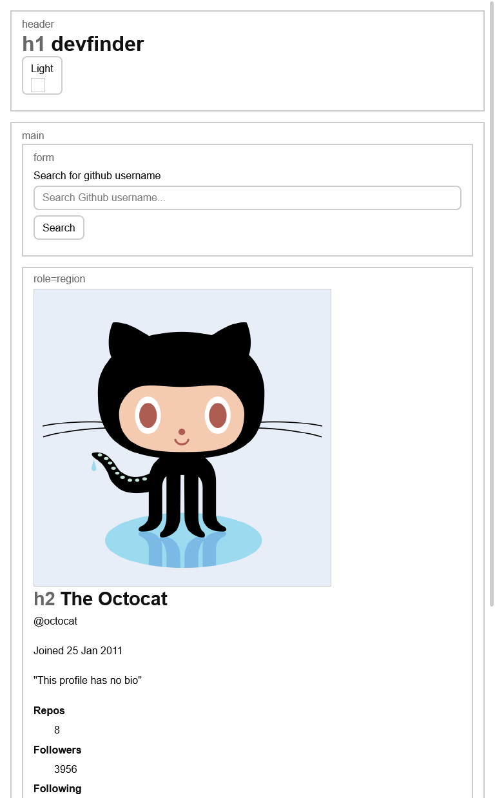
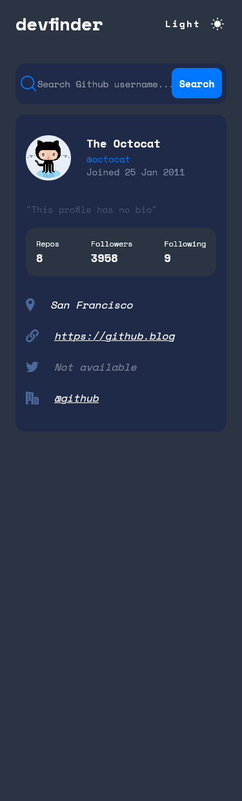
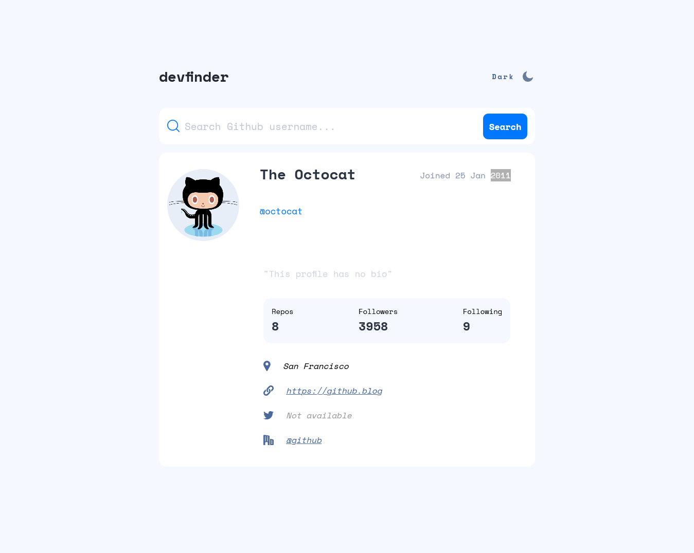
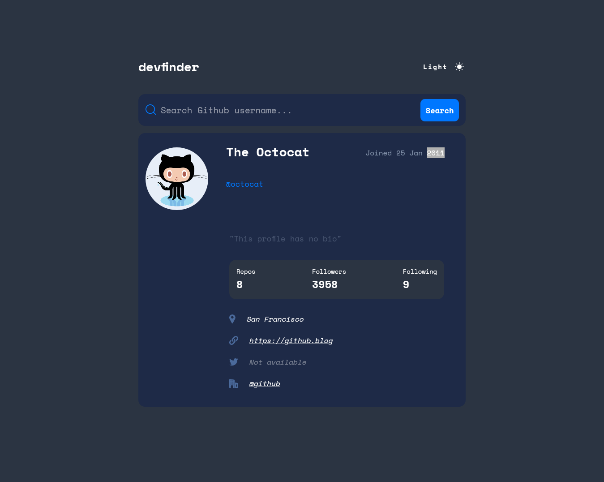

# Frontend Mentor - GitHub user search app solution

This is a solution to the [GitHub user search app challenge on Frontend Mentor](https://www.frontendmentor.io/challenges/github-user-search-app-Q09YOgaH6). Frontend Mentor challenges help you improve your coding skills by building realistic projects. 

## Table of contents

- [Overview](#overview)
  - [The challenge](#the-challenge)
  - [Screenshot](#screenshot)
  - [Links](#links)
- [My process](#my-process)
  - [Built with](#built-with)
  - [What I learned](#what-i-learned)
  - [Continued development](#continued-development)
  - [Useful resources](#useful-resources)
- [Author](#author)
- [Acknowledgments](#acknowledgments)

## Overview

### The challenge

Users should be able to:

- View the optimal layout for the app depending on their device's screen size
- See hover states for all interactive elements on the page
- Search for GitHub users by their username
- See relevant user information based on their search
- Switch between light and dark themes
- **Bonus**: Have the correct color scheme chosen for them based on their computer preferences. _Hint_: Research `prefers-color-scheme` in CSS.

### Screenshot

#### Sketch designs





#### Preview designs








### Links

- Live Site URL: [Add live site URL here](https://github-user-sa.netlify.app/)

## My process

### Built with

- Semantic HTML5 markup
- CSS custom properties
- SASS - scss theming
- Flexbox
- CSS Grid
- Mobile-first workflow
- [React](https://reactjs.org/) - JS library

### What I learned

- [themes in react](https://javascript.plainenglish.io/the-best-way-to-add-dark-mode-to-your-react-sass-project-ce3ae3bd8616)

```scss
// sass theming 
// theme refers to the mixin name
// $name refers to the classes to be added to control the themes
// the classes are theme-dark and theme-light and are added to the body element
// in this particular case the main class is the theme light and the theme-dark 
// is toggled .
// $color is the background-color and $secondary is the font colour

@mixin theme($name, $color, $secondary) {  
  .#{$name} {
    background-color: $color;    
    .theme--control {
      &:hover,
      &:focus {
        cursor: pointer;
        outline: dashed $secondary;
        outline-offset: 0.25em;
      }
    }

    .app__title,
    .user__name,
    .mode__state,
    .data__value {
      color: $secondary;
    }
    .search__user,
    .card {
      background-color: #1e2a47;
      color: $secondary;
    }

    .table__data {
      background-color: $color;
    }

    .address--link {
      color: variables.$white;
      outline: none;

      &:hover,
      &:focus {
        cursor: pointer;
        outline: dashed $secondary;
        outline-offset: 0.25em;
      }
    }
  }
}

@include theme(theme-light, variables.$lt-mode-bg, variables.$very-dark-grey);
@include theme(theme-dark, variables.$very-dark-grey, variables.$white);


### Continued development
 

### Useful resources

- [accessibility resources](https://accessibilityresources.org/aria-live)
- [How to Read React Errors - fix 'Cannot read property of undefined'!](https://daveceddia.com/fix-react-errors/)
- [themify react app with sass](https://www.webtips.dev/how-i-theme-my-react-app-with-sass)
- [the best way to add dark mode to your react/sass app](https://javascript.plainenglish.io/the-best-way-to-add-dark-mode-to-your-react-sass-project-ce3ae3bd8616)
- [sass color themes](https://www.sitepoint.com/dealing-color-schemes-sass/)
- [css theme switcher](https://joshuatz.com/posts/2019/coding-a-css-theme-switcher-a-multitude-of-web-dev-options/#method-b)
- [positioning elements in the web](https://thoughtbot.com/blog/positioning)
- [Example resource 1](https://www.example.com) - This helped me for XYZ reason. I really liked this pattern and will use it going forward.

## Author

- Website - [Chamu Mutezva](https://github.com/ChamuMutezva)
- Frontend Mentor - [@ChamuMutezva](https://www.frontendmentor.io/profile/ChamuMutezva)
- Twitter - [@ChamuMutezva](https://twitter.com/ChamuMutezva)

## Acknowledgments

- Frontend Mentor community leaders for providing a platform to engage with fellow learners and mentors. This makes the learning exciting.
